# Interfaz Gráfica en Java

Curso propuesto por el grupo de trabajo Semana de Ingenio y Diseño (**SID**) de la Universidad Distrital Francisco Jose de Caldas.

## Monitor

**Cristian Felipe Patiño Cáceres** - Estudiante de Ingeniería de Sistemas de la Universidad Distrital Francisco Jose de Caldas

# Clase 2

## Objetivos

- Identificar las 4 etapas para crear objetos gráficos básicos y así ser mostrados en pantalla en una vista.
- Aprender los métodos principales para configurar los objetos gráficos y mostrarlos por pantalla.
- Explorar el enfoque de posicionamiento por medio de pixeles sin el uso de manager de Layouts.
- Comprender la diferencia de adición hacia una ventana principal o hacia un panel

# Etapas de Creación de un Objeto Gráfico

## **Declaración**

La declaración de un objeto gráfico consiste en indicarle al sistema que la clase donde se esta trabajando tendrá un atributo de algún tipo de estos objetos. Esta declaración tiene 3 partes, estas son:

- **Tipo Acceso:** El tipo de acceso sera siempre privado ya que son atributos de la clase como se discutió en la anterior clase.
- **Tipo de Objeto Gráfico:** Se refiere a la clase del objeto que vamos a crear (JButton, JTextField, JLabel, JPanel son algunos ejemplos) y la generación de estas clases casi siempre van a necesitar la importación de la librería que soporte la creación del objeto, estas se importan automáticamente dependiendo del editor.
- **Variable:** El nombre que el programador elija darle y sera esta el objeto por el cual se podrá acceder a sus métodos.

<div align="center">
  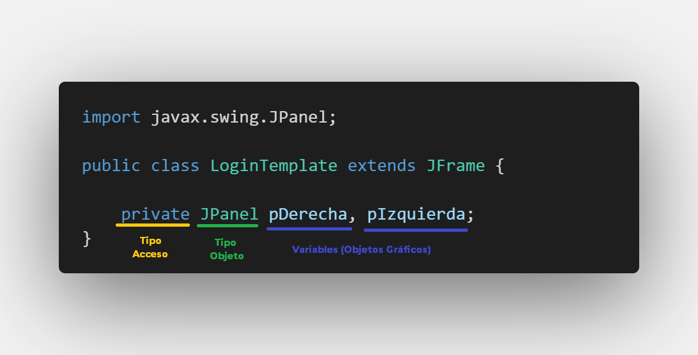
  <p>Declaración de dos objetos gráficos tipo JPanel con sus 3 partes</p>
</div>

## **Ejemplificación**

La ejemplificación del objeto Gráfico consiste en darle un valor inicial al objeto y para esto es necesario llamar al constructor de la clase, **este paso es importante y sin él no es posible realizar la configuración**. Para este curso la ejemplificación, configuración y adición se realizará dentro del **constructor** de nuestra clase.

<div align="center">
  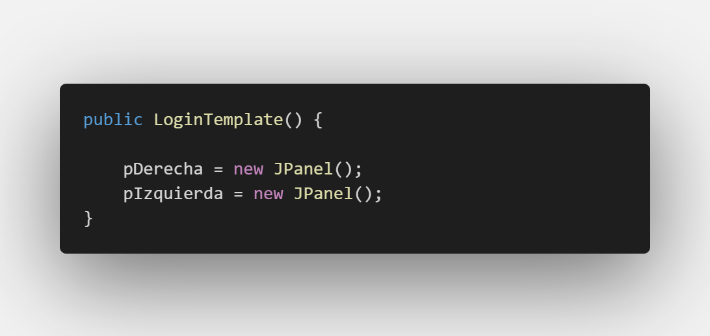
  <p>Ejemplificación de dos objetos gráficos tipo JPanel</p>
</div>

## **Configuración**

La configuración es la etapa donde llamaremos todos los métodos proporcionados por la clase del objeto gráfico para darle propiedades gráficas y este pueda verse en la pantalla. Mas adelante se explicara el propósito de cada método, por ahora solo se mostrara un ejemplo.

<div align="center">
  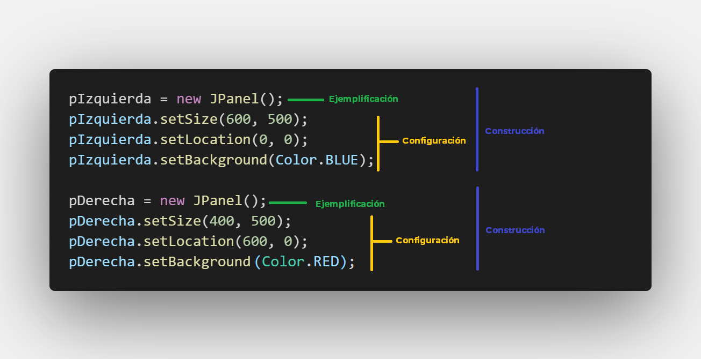
  <p>Configuración de dos objetos gráficos justo después de haberse ejemplificado </p>
</div>

## **Adición**

Hasta el momento el objeto gráfico esta listo para ser mostrado sin embargo no sera mostrado aun, para esto es necesario adicionarlo a su objeto padre, en este caso el objeto padre es la ventana. Con el método **add()** se puede añadir el objeto gráfico configurado.

<div align="center">
  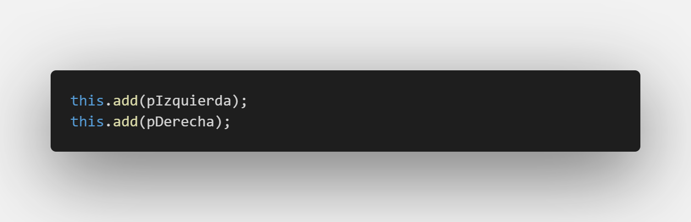
  <p>Adición de dos objetos gráficos una vez se hayan configurado </p>
</div>

Puede verse en la anterior imagen que la forma de añadir elementos gráficos en la ventana consiste en llamar **this.add()**. La palabra clave **this** hace referencia a que se esta llamando a la misma clase donde se esta codificando. Sin embargo pueden existir algunos objetos gráficos que queremos añadir no en la ventana principal, sino en un Panel por ejemplo. A continuación se muestra como se podría hacer esto.

<div align="center">
  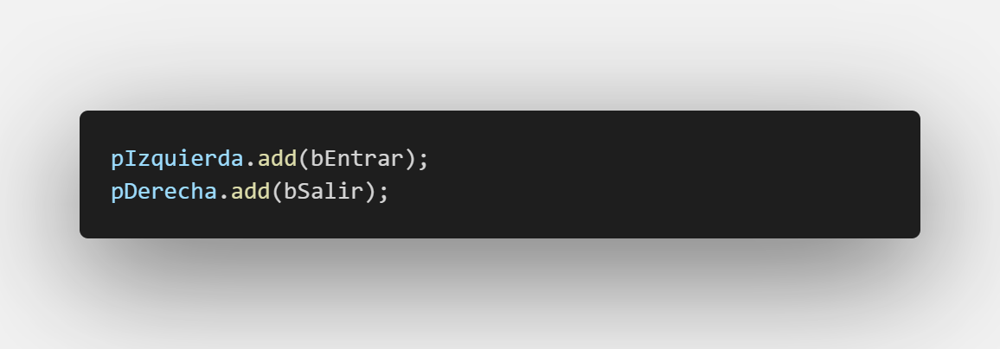
  <p>Adición de objetos gráficos dentro de Paneles </p>
</div>

# Creación de objetos gráficos básicos.

En esta sección aprenderemos la forma de crear objetos gráficos para ser mostrados en pantalla, basándonos en los 4 pasos que acabamos de ver. Los objetos explicados a continuación serán:

- **JPanel**
- **JLabel**
- **JTextField**
- **JPassworldField**
- **JComboBox**
- **JButton**
- **JCheckBox**
- **ButtonGroup**
- **JRadioButton** (Se explicara brevemente su creación ya que es similar a la de checkBox)
- **JTextArea** (Se explicara brevemente su creación ya que es similar a la de un TextField)

## Antes de comenzar

Recordando la clase 1 vamos a crear una clase que se llamara **LoginTemplate** y configuraremos la ventana.

<div align="center">
  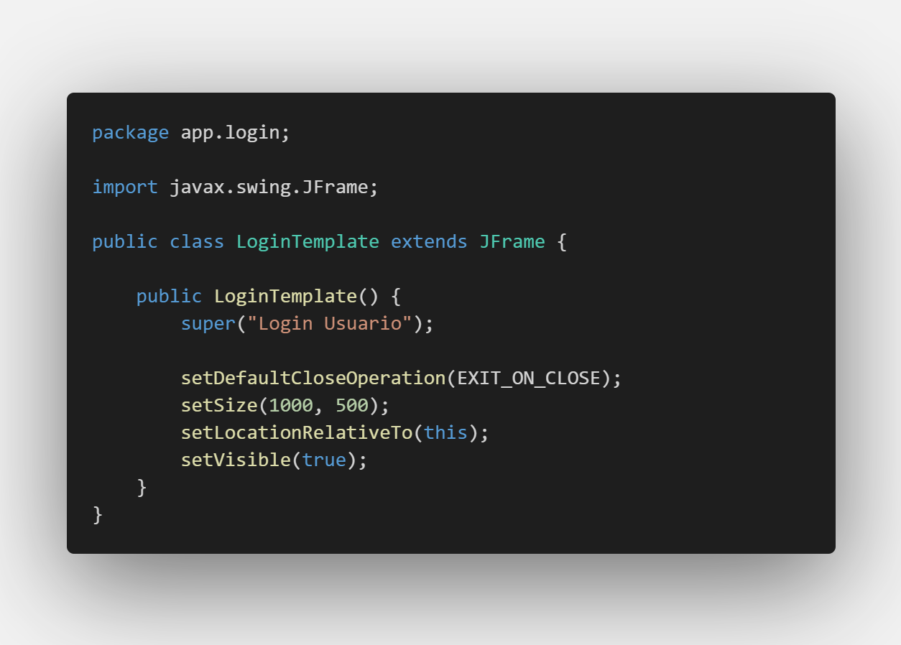
  <p>Clase de login de usuario</p>
</div>

## JPanel

Los Paneles son la mejor forma de identificar partes de una ventana y modularizar diferentes secciones de esta y así agrupar varios objetos gráficos que comparten un contexto.

Para el ejemplo de esta clase se van a crear 2 paneles (los mismos que se han creado para el ejemplo de las etapas de la creación de objetos gráficos). Una cosa a resaltar es que en la declaración de los paneles las variables (objetos) empiezan con una p minúscula seguido del nombre arbitrario de la variable, ahora nos concentraremos en explicar los métodos de configuración.

```
pIzquierda.setSize(600, 500);
pIzquierda.setLocation(0, 0);
pIzquierda.setBackground(Color.BLUE);
```

- **setSize:** Recibe por parámetros un par de enteros y definen el tamaño del panel, siendo el ancho el primer parámetro y el alto el segundo.
- **setLocation:** Recibe por parámetros un par de enteros y definen la posición del panel, la posición en el eje x es el primer parámetro y la posición en el eje y el segundo.
- **setBackground:** Recibe por parámetro un objeto Decorador de tipo Color y define el color de fondo del panel.

Los métodos **setSize** y **setLocation** pueden ser reemplazados por el método:

- **setBounds:** Que recibe por parámetros 4 números enteros de los cuales los dos primeros representan la posición y los dos últimos el tamaño **(x, y, ancho, alto)**

Hasta el momento nuestra ventana se ve algo asi:

<div align="center">
  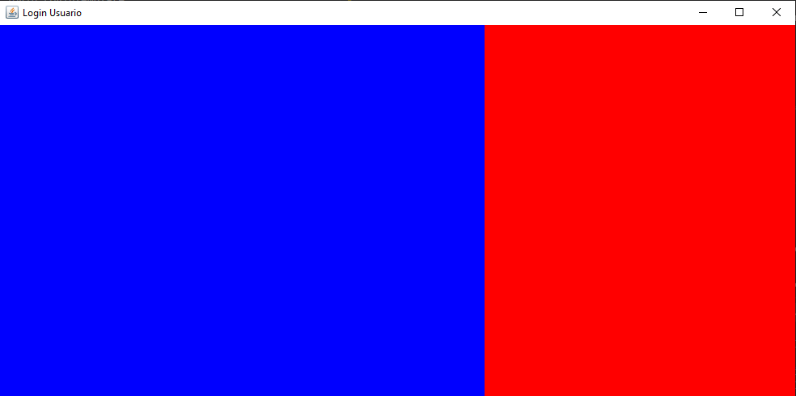
  <p>Interfaz login de usuario con 2 paneles</p>
</div>

Por ahora todo luce bien, sin embargo hay una propiedad crucial que nos hemos saltado y mas adelante recalcaremos. Los colores se pusieron a propósito para verificar la existencia de los paneles en la ventana, por ahora pondremos el color de fondo del panel **pDerecha** de color blanco.

```
pDerecha.setBackground(Color.WHITE);
```

nuestro código se vera algo asi:

<div align="center">
  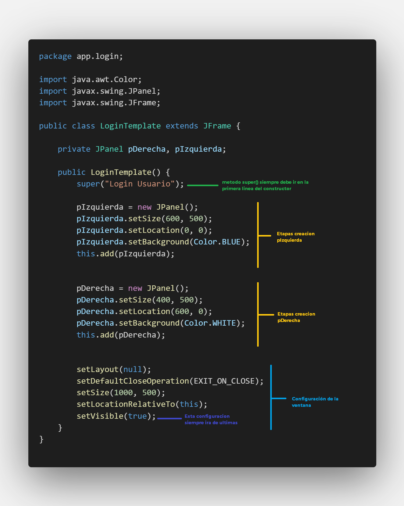
  <p>Clase de login de usuario</p>
</div>

Cabe resaltar que la configuración de la ventana siempre ira de ultimas, si se deja en otros lados probablemente el programa tendrá problemas en mostrar la interfaz. Sobretodo con la ultima linea de código **setVisible**

## JLabel

Los label en nuestras interfaces son textos que queremos mostrar en pantalla y que el usuario no podrá cambiar, normalmente los usamos para dar indicaciones, títulos, subtítulos etc.

Para empezar podemos colocar un título en nuestra interfaz, para esto crearemos un JLabel (Realizando los 4 pasos anteriores)

### Declaración

```
private JLabel lTituloApp;
```

La variable (objeto) que creemos para los label empezaran con l minúscula seguido del nombre de la variable.

### Ejemplificación

```
lTituloApp = new JLabel("Login de Usuario");
```

Se puede notar que cuando se ejemplifica el objeto de tipo JLabel este puede recibir por parámetro en el constructor un String, esto no es obligatorio, se puede crear con parámetros vacíos y mas adelante llamar al método **setText()** que también recibe un String y cumple la misma función, pero esta es una buena forma de ahorrar lineas de código.

### Configuración

```
lTituloApp.setBounds(100, 20, 200, 30);
lTituloApp.setForeground(Color.WHITE);
```

Puede notarse que en esta ocasión se utilizo el método **setBounds** en realidad las dos formas son correctas y habrán casos donde se necesita hacer de una forma u otra. A parte tenemos otro método:

- **setForeground:** recibe por parámetro un objeto decorador de tipo Color y representa el color de la fuente del JLabel.

### Adición

```
pIzquierda.add(lTituloApp);
```

Puede observarse que este objeto se añadirá al panel de la izquierda y no en la ventana. Ahora bien si intentamos correr nuestra aplicación y ver nuestro label podemos notar que este no se posiciono exactamente donde lo queríamos, ¿no se ve muy claro? ahora haremos un pequeño cambio. Posicionando nuestro objeto 100 pixeles mas hacia abajo.

```
lTituloApp.setBounds(100, 120, 200, 30);
```

Corremos nuestra aplicación y esta en la misma posición que antes.

**¿Por que esta pasando esto?**

Esto se debe al manager de posicionamiento de Java que por defecto maneja un Layout predeterminado, el cual tratará de dejar nuestros objetos en la parte central superior de nuestra pantalla, el problema ocurre cuando tenemos dos o mas objetos y este tratara de dividir el panel de forma equitativa para posicionarlos y esto no es lo que queremos muchas veces. Para esto debemos configurar nuestra ventana y nuestros paneles para que deje nula esa propiedad y **seamos nosotros quienes posicionemos nuestros objetos mediante posicionamiento en pixeles.**

```
pDerecha.setLayout(null);
pIzquierda.setLayout(null);
setLayout(null); // configuración de la ventana
```

Una vez corras la aplicación veras como el Label esta donde queríamos. Pero lo dejaremos como estaba al comienzo quitándole esos 100 pixeles, solo fue en forma de prueba.

```
lTituloApp.setBounds(100, 20, 200, 30);
```

También vamos a añadir 3 label mas:

```
private JLabel lTituloApp, lEslogan, lTituloLogin, lNotificaciones;
```

```
lEslogan = new JLabel("Te ayudamos en todo");
lEslogan.setSize(130, 20);
lEslogan.setLocation((pDerecha.getWidth() - lEslogan.getWidth()) / 2, 40);
lEslogan.setForeground(Color.DARK_GRAY);
pDerecha.add(lEslogan);

lTituloLogin = new JLabel("Registra tus Datos");
lTituloLogin.setSize(110, 30);
lTituloLogin.setLocation((pDerecha.getWidth() - lTituloLogin.getWidth()) / 2, 60);
lTituloLogin.setForeground(Color.DARK_GRAY);
pDerecha.add(lTituloLogin);

lNotificaciones = new JLabel("¿Recibir Notificaciones?");
lNotificaciones.setSize(140, 20);
lNotificaciones.setLocation((pDerecha.getWidth() - lNotificaciones.getWidth()) / 2, 370);
lNotificaciones.setForeground(Color.DARK_GRAY);
pDerecha.add(lNotificaciones);
```

En el anterior código se resalta la importancia de cuando usar el enfoque de tamaño y posicionamiento por separado. Por ejemplo cuando un elemento se quiere colocar en el centro con respecto ya sea a su panel padre o a la ventana. Para esto tenemos que hacer un calculo que es:

- **(Ancho de panel - Ancho Objeto)/ 2**

Y para conocer el ancho del objeto necesitamos obligatoriamente proporcionarle de la propiedad de tamaño usando **setSize**. Si usamos **setBounds** al pedirnos los 4 datos al tiempo este no tendrá aun un ancho definido y no podrá calcularse la anterior operación.

Nuestra ventana se ira viendo algo asi:

<div align="center">
  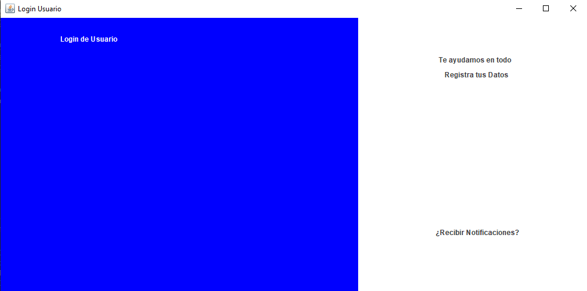
  <p>Interfaz login de usuario con paneles y labels</p>
</div>

## JTextField

Los TextField son cajas de texto donde el usuario va poder ingresar información importante que nosotros necesitamos de él. Muchas veces estará dentro de formularios donde se pide información de los usuarios, otras veces servirán como medio para realizar una consulta especifica en el servidor etc.

Para este caso necesitamos un JTextField para que el cliente pueda escribir el nombre de su usuario.

### Declaración

```
private JTextField tNombreUsuario;
```

La variable (objeto) que creemos para los textField empezaran con t minúscula seguido del nombre de la variable.

### Ejemplificación

```
tNombreUsuario = new JTextField("Nombre Usuario");
```

Al igual que con los Label estos pueden recibir un String por parámetro desde el constructor, este funciona como **placeholder** pero necesita de una configuración adicional que en esta clase no veremos por ahora. De nuevo no es obligatorio colocar el String.

### Configuración

```
tNombreUsuario.setSize(300, 40);
tNombreUsuario.setLocation((pDerecha.getWidth() - tNombreUsuario.getWidth()) / 2, 120);
tNombreUsuario.setForeground(Color.DARK_GRAY);
tNombreUsuario.setBackground(Color.WHITE);
tNombreUsuario.setCaretColor(Color.BLUE);
tNombreUsuario.setHorizontalAlignment(SwingConstants.CENTER);
```

Como los anteriores objetos gráficos tiene algunas configuraciones que ya hemos visto, mas dos nuevas propiedades:

- **setCaretColor:** recibe por parámetro un objeto decorador de tipo Color y representa el color del Caret (la linea que parpadea indicando la posición de texto para escribir)
  .
- **setHorizontalAlignment:** recibe por parámetro un objeto tipo **SwingConstants** y le da la dirección de la posición del texto. Si no se llama por defecto el texto estará posicionado en la parte izquierda, sus otras opciones principales son **CENTER** y **RIGHT**. Aunque existen mas opciones estas configuran la posición con respecto a Y, no nos interesa tanto esas opciones.

**Paréntesis**

Para asegurarnos de que nuestros JLabel también queden centrados vamos a añadir esa propiedad en la configuración de estos, aunque aquí se muestra que están seguidas estas configuraciones en nuestro código las vamos a colocar en las respectivas configuraciones de cada uno de los labels que creamos.

```
lEslogan.setHorizontalAlignment(SwingConstants.CENTER);
lTituloLogin.setHorizontalAlignment(SwingConstants.CENTER);
lNotificaciones.setHorizontalAlignment(SwingConstants.CENTER);
```

### Adición

```
pDerecha.add(tNombreUsuario);
```

## JPassworldField

Los JPassworldField son campos de texto donde el usuario va a escribir sin embargo por cuestiones de seguridad la información proporcionada por el cliente no debe ser mostrada en pantalla. Como su nombre lo indica este objeto Gráfico muchas veces se utiliza para el ingreso de Contraseñas.

### Declaración

```
private JPasswordField tClaveUsuario;
```

La variable (objeto) que creemos para los JPassworldField empezaran con t minúscula seguido del nombre de la variable.

### Ejemplificación

```
tClaveUsuario = new JPasswordField("clave Usuario");
```

### Configuración

```
tClaveUsuario.setSize(300, 40);
tClaveUsuario.setLocation((pDerecha.getWidth() - tClaveUsuario.getWidth()) / 2, 240);
tClaveUsuario.setForeground(Color.DARK_GRAY);
tClaveUsuario.setCaretColor(Color.BLUE);
tClaveUsuario.setHorizontalAlignment(SwingConstants.CENTER);
```

### Adición

```
pDerecha.add(tClaveUsuario);
```

Podemos notar que una vez se ejecuta la aplicación en el campo de la clave del usuario este saldrá en forma de puntos escondiendo la información que el usuario coloque allí.

## JComboBox

Muchas veces el usuario tendrá que escoger entre varias opciones y de esas nos interesa tener ciertas opciones controladas para evitar que una base de datos por ejemplo se llene de muchas opciones innecesarias. Para eso podremos usar un JComboBox donde el usuario puede seleccionar opciones predeterminadas.

En este caso usaremos un ComboBox para escoger el tipo de usuario:

### Declaración

```
private JComboBox cbTipoUsuario;
```

La variable (objeto) que creemos para los JComboBox empezaran con cb minúscula seguido del nombre de la variable.

### Ejemplificación

```
cbTipoUsuario = new JComboBox();
```

### Configuración

```
cbTipoUsuario.addItem("Cliente");
cbTipoUsuario.addItem("Cajero");
cbTipoUsuario.addItem("Administrador");
cbTipoUsuario.setSize(220, 30);
cbTipoUsuario.setLocation((pDerecha.getWidth() - cbTipoUsuario.getWidth()) / 2, 185);
cbTipoUsuario.setForeground(Color.DARK_GRAY);
cbTipoUsuario.setBackground(Color.WHITE);
((JLabel) cbTipoUsuario.getRenderer()).setHorizontalAlignment(SwingConstants.CENTER);
```

A parte de las configuraciones que ya se vieron antes en este caso existen dos particularidades:

- **addItem:** recibe por parámetro un String y lo admite como opción a seleccionar por el usuario.
- **getRenderer, setHorizontalAlignment:** Si se quieren centrar los elementos dentro de un ComboBox, esto no se podrá de forma directa. Cada una de las opciones dentro del ComboBox son tratados como Labels y para obtener su valor es necesario pedirle al ComboBox los elementos con el método **getRenderer**. Una vez obtenemos los elementos (JLabels) es necesario hacer un **Cast** de objeto para asi obtener las configuraciones propias de un JLabel **((JLabel) cbTipoUsuario.getRenderer())** de lo contrario al poner . (punto) y esperar las opciones no se vera la opción **setHorizontalAlignment**.

### Adición

```
pDerecha.add(cbTipoUsuario);
```

## JButton

Los botones son la forma mas común con la que un usuario podrá interactuar con las interfaces gráficas. Estos botones generan acciones que el usuario puede activar al dar Click sobre estos, entre algunas opciones, puede estar el envió de información, traer información, abrir otras secciones etc.

### Declaración

```
private JButton bEntrar;
```

La variable (objeto) que creemos para los JButton empezaran con b minúscula seguido del nombre de la variable.

### Ejemplificación

```
bEntrar = new JButton("Entrar");
```

Un Botón puede recibir por parámetro en el constructor un String que representa el texto, de nuevo se puede realizar también mediante el método **setText**.

### Configuración

```
bEntrar.setSize(250, 45);
bEntrar.setLocation((pDerecha.getWidth() - bEntrar.getWidth()) / 2, 300);
bEntrar.setBackground(Color.BLUE);
bEntrar.setForeground(Color.WHITE);
bEntrar.setFocusable(false);
```

A parte de las configuraciones que ya se vieron antes en este caso existen dos particularidades:

- **setHorizontalAlignment:** Por defecto los botones van a poner el texto centrado pero en caso de que se quiera colocar el texto a la izquierda o a la derecha se puede utilizar este método.
- **setFocusable:** Recibe por parámetro un booleano que por defecto esta en True, si le cambiamos la configuración a False va a quitar el cuadro por defecto que rodea al texto del botón una vez se oprima click.

<div align="center">
  
  <p>Botón con SetFocusable(True)</p>
</div>

<div align="center">
  
  <p>Botón con SetFocusable(False)</p>
</div>

### Adición

```
pDerecha.add(bEntrar);
```

Hasta el momento nuestra interfaz se ve asi:

<div align="center">
  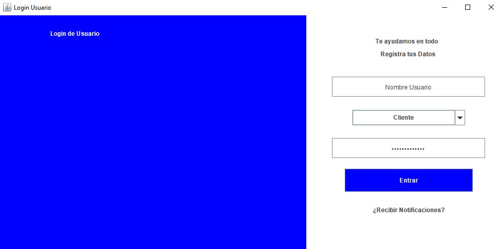
  <p>Interfaz login de usuario con los nuevos objetos añadidos</p>
</div>

Vamos añadir 5 botones más con lo que aprendimos, estos botones por esta clase no tendrán propósito pero mas adelante si lo tendrán:

```
private JButton bEntrar, bCerrar, bRegistrarse, bOpcion1, bOpcion2, bOpcion3;
```

```
bCerrar = new JButton("X");
bCerrar.setBounds(330, 10, 45, 30);
bCerrar.setFocusable(false);
bCerrar.setBackground(Color.BLUE);
bCerrar.setForeground(Color.WHITE);
pDerecha.add(bCerrar);

bRegistrarse = new JButton("Registrarse");
bRegistrarse.setBounds(230, 420, 145, 35);
bRegistrarse.setFocusable(false);
bRegistrarse.setBackground(Color.BLUE);
bRegistrarse.setForeground(Color.WHITE);
pDerecha.add(bRegistrarse);

bOpcion1 = new JButton();
bOpcion1.setBounds(10, 220, 30, 20);
pIzquierda.add(bOpcion1);

bOpcion2 = new JButton();
bOpcion2.setBounds(10, 250, 30, 20);
pIzquierda.add(bOpcion2);

bOpcion3 = new JButton();
bOpcion3.setBounds(10, 280, 30, 20);
pIzquierda.add(bOpcion3);
```

y nuestra interfaz se ve ahora así:

<div align="center">
  
  <p>Interfaz login de usuario, con adición de mas botones</p>
</div>

## JCheckButton

Los CheckButton normalmente son usados para cubrir estados de varias opciones, puede utilizar varios enfoques:

- elección multiple de opciones
- elección de una sola opción.

### Declaración

```
private JCheckBox checkSi, checkNo;
```

La variable (objeto) que creemos para los JCheckButton empezaran con check en minúscula seguido del nombre de la variable.

### Ejemplificación

```
checkSi = new JCheckBox("Si");
checkNo = new JCheckBox("No");
```

### Configuración

```
checkSi.setSize(45, 25);
checkSi.setFocusable(false);
checkSi.setBackground(Color.WHITE);
checkSi.setLocation((pDerecha.getWidth() - checkSi.getWidth()) / 2 - 15, 345);

checkNo.setSize(45, 25);
checkNo.setFocusable(false);
checkNo.setBackground(Color.WHITE);
checkNo.setLocation((pDerecha.getWidth() + checkNo.getWidth()) / 2 - 15, 345);
```

### Adición

```
pDerecha.add(checkSi);
pDerecha.add(checkNo);
```

En nuestra aplicación queremos tomar el enfoque de única opción, sin embargo al correr nuestra app, podemos notar que se pueden seleccionan las dos opciones.

<div align="center">
  
  <p>CheckBox con multiple opción</p>
</div>

Para obtener el enfoque de única opción debemos configurar el siguiente objeto.

## ButtonGroup

Este es un objeto gráfico auxiliar que nos ayuda a agrupar objetos en un contexto y realizar acciones con esta agrupación. Es usado en la mayoría de casos para realizar un enfoque de única respuestas con los objetos de CheckButton o RadioButton. Este al ser un objeto Auxiliar (no tiene representación gráfica) no sera necesario adicionarlo en ningún componente.

### Declaración

```
private ButtonGroup grupo;
```

La variable (objeto) que creemos para los ButtonGroup empezaran con grupo en minúscula seguido del nombre de la variable. En este caso al haber solo un ButtonGroup solo pondremos la palabra clave.

### Ejemplificación

```
grupo = new ButtonGroup();
```

### Configuración

```
grupo.add(checkSi);
grupo.add(checkNo);
```

En la configuración es donde se van añadir los botones que pertenecen a un mismo contexto para que se pueda seleccionar una única opción. Al correr la aplicación se puede comprobar lo antes dicho.

## JRadioButton

Los RadioButton cumplen la misma función que los checkButton, es mas de elección del desarrollador cual de los dos quiera usar. De nuevo tienen los enfoques de multiples opciones o única opción utilizando un buttonGroup.

En este caso nuestra interfaz no tendrá RadioButtons pero a continuación se muestra un ejemplo para su creación.

### Declaración

```
private JRadioButton rbOpcion1, rbOpcion2;
```

La variable (objeto) que creemos para los JRadioButton empezaran con rb en minúscula seguido del nombre de la variable.

### Ejemplificación

```
rbOpcion1= new JRadioButton("opcion1");
rbOpcion2= new JRadioButton("opcion2");
```

### Configuración

```
rbOpcion1.setBounds(50, 400, 120, 30);
rbOpcion2.setBounds(200, 400, 120, 30);
```

### Adición

```
panel.add(rbOpcion1);
panel.add(rbOpcion2);
```

## JTextArea

Un objeto gráfico textArea expande un poco el concepto de los textField ya que soporta una mayor cantidad de texto y esta diseñado justamente para recibir grandes cantidades de texto. A continuación se muestra una breve explicación de su creación:

### Declaración

```
private JTextArea taSugerencias;
```

La variable (objeto) que creemos para los JTextArea empezaran con ta en minúscula seguido del nombre de la variable.

### Ejemplificación

```
taSugerencias= new JTextArea("Escribe algo...");
```

### Configuración

```
taSugerencias.setBounds(10, 10, 230, 140);
```

### Adición

```
panel.add(taSugerencias);
```

# Resultado

<div align="center">
  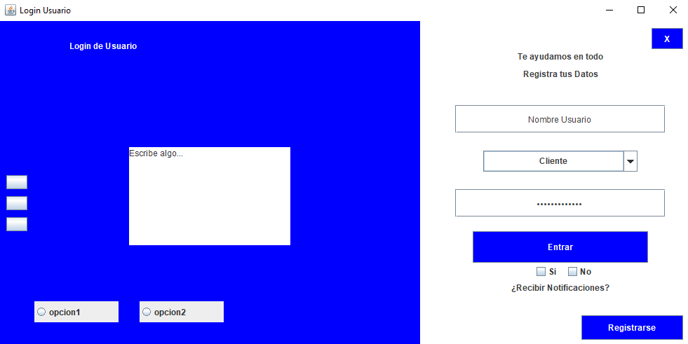
  <p>Interfaz login de usuario, resultado Final</p>
</div>

Este es nuestro resultado, hasta el momento aprendimos la configuración de objetos básicos y los mostramos en pantalla. En la siguiente clase aprenderemos sobre objetos decoradores para hacer que nuestra interfaz se vea mucho mas agradable a la vista del usuario.

# Actividades

Realizar un Login diferente al propuesto en clase, el login de usuario que se vaya a realizar sera parte del proyecto final asi que puede ser buena idea pensar como seria el login de acuerdo a la aplicación escogida como proyecto.
